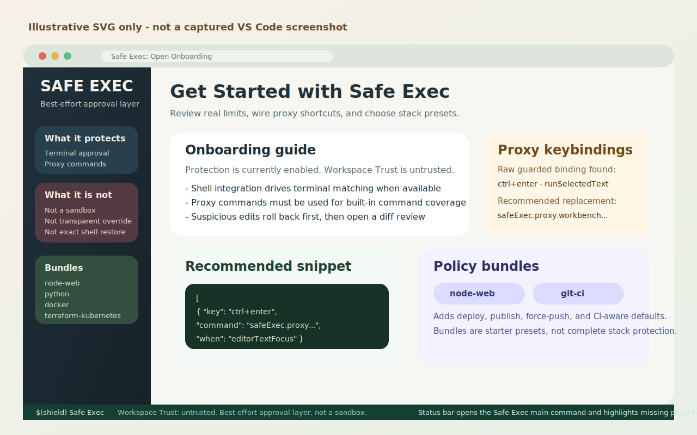
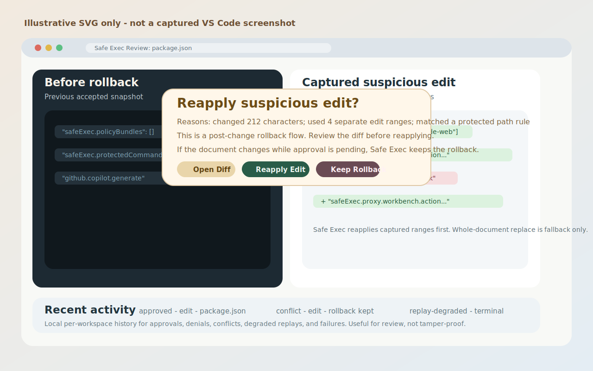

# VS Code Safe Exec

[](https://github.com/gptvibe/VS-Code-Safe-Exec/actions/workflows/ci.yml)
[](CONTRIBUTING.md#quality-gates)
[](https://eslint.org)

VS Code Safe Exec is a best-effort approval and recovery layer for risky actions that happen inside VS Code, especially when AI agents or automation can move faster than a human can comfortably review.

Safe Exec is deliberately not a sandbox. It does not claim hard isolation, guaranteed prevention, or transparent interception of every risky action. It slows down risky flows where stable VS Code APIs make that practical, records what it saw, and says where coverage ends.

## At a glance

- Risky terminal commands are matched after VS Code shell integration reports them.
- Selected VS Code commands are approval-gated only through explicit Safe Exec proxy and wrapper commands.
- Large or sensitive text edits are handled with rollback, diff review, and reapply.
- Supported VS Code create, delete, and rename file-operation events are evaluated and recorded.
- Recoverable snapshots are captured for supported delete and rename flows when file size, file count, and file type limits allow it.
- Oversized files can fall back to metadata-only entries, and unsupported or unreadable targets can fall back to observed-only entries.
- Workspace Trust is surfaced honestly, but it is not treated as a security boundary.
- A hardening checklist and starter templates show how to use Safe Exec with Workspace Trust, agent hooks, and sandboxing instead of claiming it replaces them.
- Recent approvals, denials, degraded terminal replays, edit outcomes, file-operation events, and restore outcomes are recorded per workspace in local history.

## Illustrative UX



_Illustrative SVG, not a captured VS Code screenshot._



_Illustrative SVG, not a captured VS Code screenshot._


_Illustrative SVG, not a captured VS Code screenshot._

## What Safe Exec covers

### 1. Risky terminal commands

Safe Exec watches terminal shell execution through stable VS Code shell-integration APIs. When a command matches `dangerousCommands` or `confirmationCommands`, it tries to:

1. interrupt and dispose the original terminal
2. show a modal approval dialog
3. replay the command in a fresh terminal only if you approve it

Replay fidelity is best effort:

- Safe Exec preserves captured `cwd` when VS Code exposes it.
- Safe Exec preserves replayable launch options such as shell path, shell args, and environment when available.
- Safe Exec prefers shell-integration-backed replay with `executeCommand(...)`.
- If replay shell integration is unavailable or fails, Safe Exec falls back to `sendText(...)`.
- The approval dialog calls out degraded context such as `cwd unknown`, `shell integration unavailable in the replay terminal`, or `replay may not match original shell state`.

Important: terminal handling is post-start, not pre-execution blocking. A risky command may already have started before Safe Exec interrupts or disposes the terminal.

### 2. Suspicious edits

Safe Exec snapshots open text documents. When an edit crosses configured thresholds, uses many edit ranges, or touches a protected path, it:

1. restores the previous snapshot
2. offers `Review Diff`, `Reapply Edit`, and `Deny`
3. opens a real VS Code diff review on demand
4. reapplies only the captured edit ranges when you approve
5. falls back to whole-document replacement only if range-based reapply is not possible

If the document changes while approval is pending, Safe Exec does not overwrite the newer content. It keeps the rollback, shows a clear conflict message, and asks the user to reapply manually if they still want the change.

Important: edit protection is rollback-and-reapply. VS Code has already applied the edit by the time Safe Exec sees the change event.

### 3. File operations

Safe Exec now includes a dedicated file-operation interceptor built on stable VS Code workspace events:

- `workspace.onWillCreateFiles`
- `workspace.onWillDeleteFiles`
- `workspace.onWillRenameFiles`
- `workspace.onDidCreateFiles`
- `workspace.onDidDeleteFiles`
- `workspace.onDidRenameFiles`

Coverage is explicit:

- Safe Exec evaluates create, delete, and rename operations only when VS Code emits those events.
- In practice that means user file gestures and `workspace.applyEdit(...)` file operations are covered when VS Code routes them through these hooks.
- External disk changes are not covered.
- `workspace.fs` mutations may bypass these hooks.

Current implementation note: file operations are not approval-gated today. Safe Exec classifies what VS Code reported, captures snapshots when possible, and records the result, but it does not show a file-operation allow or deny prompt.

For supported delete and rename flows, Safe Exec performs a best-effort preflight before the operation completes:

1. classify the operation by protected paths, sensitive names or extensions, bulk count, and subtree involvement
2. capture recoverable snapshots when feasible
3. fall back to metadata-only tracking when the file is too large, the file-count cap is reached, the URI is unsupported, or binary snapshots are disabled
4. record the preflight result honestly in local audit history and recovery storage without pretending the path is universally blockable

What recovery means today:

- Text files: full-content restore from the captured snapshot
- Small binary files: byte-for-byte restore when binary snapshots are enabled
- Directories: structure is recorded so Safe Exec can recreate or rename back supported paths during restore
- Oversized files or skipped binary capture: metadata-only history, not content recovery
- Unsupported URIs or unreadable targets: observed-only entries, not content recovery

Current file-operation commands:

- `Safe Exec: Show Recent File Operations`
- `Safe Exec: Restore Last Recoverable File Operation`
- `Safe Exec: Browse Recoverable File Operations`

Restore behavior stays conservative:

- Delete restores recreate directories and rewrite captured file contents when the original path is still absent.
- Rename restores move the renamed path back if the current contents still match the snapshot.
- If a renamed file has diverged, Safe Exec restores the original path from the snapshot and leaves the renamed path in place instead of deleting newer content.
- Create operations are tracked for review, but Safe Exec does not automatically reverse them.

Recovery storage is extension-managed, bounded, and garbage-collected. The current implementation keeps up to 60 recent file-operation records and prunes older snapshots once the stored payloads grow past roughly 20 MiB.

### 4. Explicit VS Code command wrappers

Safe Exec does not pretend built-in commands can be transparently overridden. Command approval works only through explicit Safe Exec commands:

- `safeExec.proxy.workbench.action.terminal.runSelectedText`
- `safeExec.proxy.workbench.action.tasks.runTask`
- `safeExec.proxy.notebook.execute`
- `safeExec.proxy.notebook.cell.execute`
- `safeExec.proxy.interactive.execute`
- `safeExec.proxy.workbench.extensions.installExtension`
- `safeExec.proxy.workbench.extensions.uninstallExtension`
- `safeExec.runProtectedCommand`

The built-in command IDs above were verified against the VS Code Built-in Commands reference updated on March 25, 2026 and against the current VS Code 1.113.0 test host used in this repository.

Wrapper-first flows stay explicit too. `safeExec.runProtectedCommand` is the recommended route for commands like `vscode.openFolder` and `vscode.newWindow` where the arguments matter as much as the command ID.

If a user or agent invokes the raw built-in command instead of a Safe Exec proxy or wrapper, Safe Exec does not claim approval coverage it does not have.

Extension-contributed commands such as `github.copilot.generate` can still be routed through dedicated Safe Exec proxies when they exist in the current session, but they are not treated as part of the stable built-in command set above.

## First-run and onboarding

Safe Exec includes a first-run onboarding flow, a main command, and a native walkthrough:

- `Safe Exec: Open Safe Exec`
- `Safe Exec: Open Onboarding`
- `Safe Exec: Open Hardening Checklist`
- `Get Started with Safe Exec`
- `Safe Exec: Open Recommended Proxy And Wrapper Keybindings`

The onboarding guide explains:

- what Safe Exec covers
- where coverage stops
- how Workspace Trust fits in
- which proxy and wrapper keybindings are recommended
- which automation-heavy built-in command IDs were verified for this extension
- which policy bundles are available
- how file-operation recovery works and where it does not apply
- how to layer Safe Exec with Workspace Trust, agent hooks, and sandboxing
- where the optional starter templates for dev containers, Docker workspaces, and hook guidance live

Safe Exec can inspect the user `keybindings.json` file, warn when common raw guarded commands are bound directly without an equivalent Safe Exec proxy binding, and call out when common guarded commands still have no proxy shortcut at all. It opens recommended proxy and wrapper JSON snippets beside the user keybindings file, but it does not edit keybindings automatically.

## Status bar and recent activity

Safe Exec shows a status bar item that surfaces whether protection is:

- enabled
- disabled
- running in an untrusted workspace
- missing recommended proxy keybinding coverage

The status bar opens the Safe Exec main command.

Two recent-history surfaces are available:

- `Safe Exec: Show Recent Activity`
  This opens local per-workspace audit history for approvals, denials, replay outcomes, edit outcomes, file-operation events, and restore results.
- `Safe Exec: Show Recent File Operations`
  This opens a file-operation-focused view backed by extension-managed recovery storage.

That history is useful for review and debugging, but it is not tamper-proof and should not be treated as a forensic record.

Structured audit events now include:

- terminal outcomes such as `matched`, `interrupted-attempted`, `dispose-attempted`, `approved`, `denied`, `replayed`, `replay-degraded`, and `replay-failed`
- edit outcomes such as `intercepted`, `reviewed`, `approved`, `range-based`, `whole-document-fallback`, `conflict-cancelled`, and `failed`
- file-operation outcomes such as `evaluated`, `intercepted`, `snapshot-created`, `metadata-only`, `unrecoverable`, `create`, `delete`, `rename`, `restore-started`, `restored`, and `restore-failed`
- workspace and command status events such as `status`

## Workspace Trust

Safe Exec integrates with VS Code Workspace Trust in an honest way:

- it still works in untrusted workspaces where stable APIs allow it
- it records workspace trust state changes in local audit history
- it surfaces trust state in the status bar and onboarding flow
- it does not claim Workspace Trust is a sandbox or a replacement for approval prompts

Workspace Trust can reduce some automatic workspace behavior in VS Code. It does not isolate shell commands, extensions, or the operating system.

## Layered hardening

Safe Exec is strongest when it is one part of a layered workflow:

- Safe Exec handles approval, review, recent activity, and bounded recovery inside VS Code.
- Workspace Trust can reduce some automatic workspace behavior, but it is not sandboxing.
- Agent hooks can reject or reroute risky automation before it runs.
- Containers, Docker workspaces, VMs, remote hosts, and least-privilege accounts provide isolation that Safe Exec does not claim to replace.

Use `Safe Exec: Open Hardening Checklist` for a checklist that ties those layers together, plus optional starter files:

- [`HARDENING_CHECKLIST.md`](HARDENING_CHECKLIST.md)
- [`starter-templates/devcontainer/devcontainer.json`](starter-templates/devcontainer/devcontainer.json)
- [`starter-templates/docker-workspace/compose.yaml`](starter-templates/docker-workspace/compose.yaml)
- [`starter-templates/hooks/README.md`](starter-templates/hooks/README.md)

## Policy bundles

Safe Exec includes opt-in policy bundles for common stacks and risky workflows:

- `node-web`
- `python`
- `docker`
- `terraform-kubernetes`
- `git-ci`
- `system-admin`
- `persistence`
- `secrets-identity`
- `cloud-release`

Bundles add stack-specific command rules and protected-path patterns. File-operation protection reuses those path patterns instead of inventing a separate stack model, and it can also merge bundle-provided file-op-sensitive names or extensions when a bundle defines them.

Examples:

- `node-web` adds package publishing, deploy-style scripts, and web toolchain config patterns.
- `python` adds Python packaging, lock, and environment patterns.
- `docker` adds container lifecycle and Docker config patterns.
- `terraform-kubernetes` adds Terraform apply, Helm, and Kubernetes mutation patterns.
- `git-ci` adds force-push and CI workflow patterns.
- `system-admin` adds cross-platform disk, volume, and partition-destruction patterns plus storage-admin config files.
- `persistence` adds service, scheduled-task, autorun, and shell-profile persistence patterns across Linux, macOS, and Windows.
- `secrets-identity` adds credential-store and identity-file path protection plus upload-style network command coverage.
- `cloud-release` adds registry publish, container push, release publication, and common cloud deploy command coverage.

## Quick start

1. Install the extension.
2. Open `Safe Exec: Open Safe Exec` or click the Safe Exec status bar item.
3. Review `Safe Exec: Open Recommended Proxy And Wrapper Keybindings` and route the shortcuts or automation commands you actually use through Safe Exec.
4. Open `Safe Exec: Open Hardening Checklist` and decide which hook and sandboxing layers you want around the workspace.
5. Open `Safe Exec: Open Rules File` and enable any policy bundles that match your stack.
6. Review `Safe Exec: Show Recent File Operations` so you know where recoverable delete and rename history will appear.
7. Keep an eye on the status bar state, `Safe Exec: Show Recent Activity`, and `Safe Exec: Show Recent File Operations`.

Example workspace rules file:

```json
{
  "policyBundles": ["node-web", "git-ci"],
  "confirmationCommands": [
    {
      "pattern": "\\bwrangler\\s+secret\\s+put\\b",
      "description": "Update Cloudflare secrets",
      "risk": "high"
    }
  ],
  "protectedCommands": [
    {
      "command": "workbench.action.tasks.runTask",
      "description": "Always require approval for tasks",
      "risk": "high"
    }
  ],
  "fileOps": {
    "maxSnapshotBytes": 131072,
    "protectedPathPatterns": [
      "(^|[\\\\/])release[\\\\/]"
    ],
    "captureBinarySnapshots": false
  }
}
```

## Configuration

Important settings:

- `safeExec.enabled`
- `safeExec.rulesPath`
- `safeExec.policyBundles`
- `safeExec.protectedCommands`
- `safeExec.terminal.killStrategy`
- `safeExec.terminal.criticalReplayPolicy`
- `safeExec.editHeuristics.minChangedCharacters`
- `safeExec.editHeuristics.minAffectedLines`
- `safeExec.editHeuristics.maxPreviewCharacters`
- `safeExec.fileOps.enabled`
- `safeExec.fileOps.maxSnapshotBytes`
- `safeExec.fileOps.maxFilesPerOperation`
- `safeExec.fileOps.minBulkOperationCount`
- `safeExec.fileOps.protectedPathPatterns`
- `safeExec.fileOps.ignoredPathPatterns`
- `safeExec.fileOps.sensitiveExtensions`
- `safeExec.fileOps.sensitiveFileNames`
- `safeExec.fileOps.captureBinarySnapshots`

`safeExec.editHeuristics.maxPreviewCharacters` is now a legacy compatibility setting. Safe Exec uses a real diff review flow for suspicious edits; this setting no longer controls the primary review experience.

`safeExec.fileOps.ignoredPathPatterns` lowers the risk signal from matching file-operation paths unless those paths are also protected or sensitive. Safe Exec still records the observed operation when VS Code emits the event.

`safeExec.fileOps.*` settings override the built-in file-operation defaults only when you set them explicitly. Safe Exec keeps the additive merge model:

- defaults first
- rules file additions next
- policy bundle contributions merged in
- explicit settings last

See [RULES.md](RULES.md) for file-op rule shapes, merge behavior, and bundle details.

## Protected-path defaults

The built-in protected-path defaults now feed both edit review and file-operation evaluation. They include common high-value paths such as:

- `.github/` and common CI config
- `.vscode/`
- `.env*`
- `package.json` and major lockfiles
- Python packaging files
- `Dockerfile` and compose files
- Terraform and Helm files
- `Jenkinsfile`

File operations also include built-in sensitive file names and extensions for items such as certificate material, keystores, Terraform state, and related high-value artifacts.

These defaults are configurable. They are meant to catch sensitive edits, deletes, and renames more often, not to freeze those files permanently.

## Platform support

Safe Exec aims for useful best-effort behavior on:

- macOS
- Linux
- Windows

Built-in terminal rules include Unix-style commands, PowerShell commands, `cmd.exe` commands, and macOS disk utility examples. File-operation recovery currently assumes local filesystem-backed workspaces for actual content snapshots and restores. Coverage is still incomplete by design; teams should add their own rules for local shells, aliases, scripts, and high-value paths.

## Limits and bypasses

Safe Exec is intentionally explicit about residual risk:

- terminal interception depends on shell integration and is post-start
- terminal replay happens in a fresh terminal and cannot restore exact shell state
- built-in commands are not secretly wrapped; only Safe Exec proxies and wrappers are protected
- keybindings that call raw built-in commands bypass proxy approval
- edit interception is post-change, so rollback can race with later edits
- file-operation coverage depends on VS Code file-operation events, is best effort, and does not currently open an approval prompt
- external disk changes are outside file-operation coverage
- `workspace.fs` operations may bypass the file-operation hooks
- file-operation restore is bounded by snapshot byte limits, file-count limits, file type support, and path conflicts during restore
- create operations are recorded but not automatically reversed
- audit history is local workspace state or extension-managed storage, best effort, and not tamper-proof

If you need hard isolation, use OS-level permissions, containers, VMs, CI isolation, and least-privilege accounts. Safe Exec is a friction layer, not a sandbox.

## Contributing

Safe Exec now ships with release-grade CI gates. Before opening a pull request, run:

```bash
npm run check
```

Or run the individual steps:

```bash
npm run lint
npm run typecheck
npm run compile
npm test
npm run coverage
```

CI runs the quality gate on Ubuntu and the extension test suite on Ubuntu, Windows, and macOS. See [CONTRIBUTING.md](CONTRIBUTING.md) for local setup, coverage expectations, and pull request guidance.

## More detail

- [COVERAGE_MATRIX.md](COVERAGE_MATRIX.md) lists current surface-by-surface coverage and bypasses.
- [CONTRIBUTING.md](CONTRIBUTING.md) explains the local workflow and CI quality gates.
- [DESIGN.md](DESIGN.md) explains the architecture and tradeoffs.
- [HARDENING_CHECKLIST.md](HARDENING_CHECKLIST.md) explains how to layer Safe Exec with Workspace Trust, agent hooks, and sandboxing.
- [RULES.md](RULES.md) explains rules, bundles, and merge behavior.
- [SECURITY.md](SECURITY.md) explains the security posture, bypasses, and residual risk.
- [AGENTS.md](AGENTS.md) explains the agent behavior expected in this repository.
